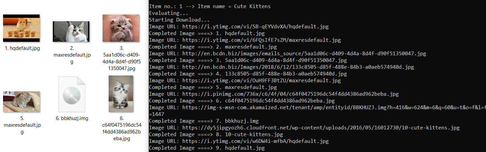

# Google_Search_in_python3
There are several different google search library for python out there.
In this repo I use some of them to create a more easy to use and generic search function and download ability.

# Purpose
The reason I want to be able to preform searches through a search engine is to create large datasets for machine learning.
Mainly I created this repo to make the google search calls easier to use, by setting alot of the default parameters.
Both textual and images. I will probably reuse some code from this repo in future development.
If no intrest is shown to this repo it will probably be removed from github eventually, to merge it with a larger project.

# How to use
Copy the "Google_Search_Functions.py" file into your project.
Try running the test.py file.
This file contains the following code:
```
import Google_Search_Functions as google

google.search("Cute Kittens", type = "image", download = True, num = 10);
```
This program will download 10 images of "Cute Kittens" from google search into a folder callded "downloads".
See default values in Google_Search_Functions, there you can see several other intresting parameters.

# More Code Examples
Search 10 websites:
```
response = google.search("Cute Kittens");
```
Search and download 11 Swedish news:
```
response = google.search("Cute Kittens", type = "news", num = 11, lang="sv", download = True);
```
Safe search 10 video:
```
response = google.search("Cute Kittens", type = "video", Safe = "true");
```
Search and download 10 images with rights and output path:
```
response = google.search("Cute Kittens", type = "image", Safe = "true", path = 'path', download = True, rights ="labeled-for-nocommercial-reuse" );
```

# About
This implementation lets you download or get urls to websites for google searches.
Depending on parameters you might get different return values. Check them out in the "Google_Search_Functions" file.
The reason I use and depend on other libraries are to save time.
However it is possible that I will recreate this repo in the future and then instead write from scratch to make a more clean solution.
The solution would include alot of scrapeing from google.
In the library google-images-download some html scrape is used.
See link below and check out the code if you plan to instead scrape and make your own implementation.
My thoughts in the matter right now is, why reinvent the wheel?
This implementation is good enough.

# Further development
In the future it might be intresting to use other search engines such as bing, DuckDuckGo, Wiki.com, Twitter, CC Search, Gibiru, StartPage.
I might choose to create my entire own implementation in the future if I for some reason don't like this solution.

# Screenshots
Download 10 images of "Cute kittens":


# Requirements
In this python program we use the following imports:
```
import google                   # Search links
import google_images_download   # Search and download images
```
Install them by writing:
```
pip install -r requirements.txt
```

# Sources and References
Information and examples of how to use:
* google-image-download library
https://github.com/hardikvasa/google-images-download

* googlesearch library
https://python-googlesearch.readthedocs.io/en/latest/

# Disclaimer
These functions lets you download tons of data from Google. Please do not download or use any data that violates its copyright terms. Google is a search engine that merely indexes data and allows you to find them. It does NOT produce its own data and, as such, it doesn't own copyright on any of them. The original creators of the data own the copyrights. Read Google TOS before using google search functions.
